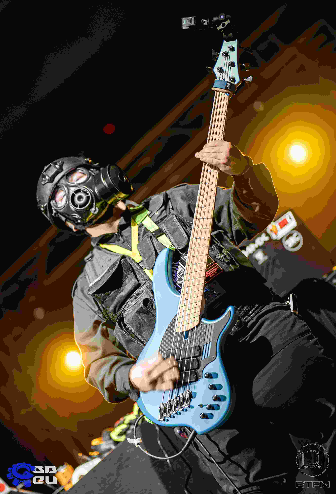
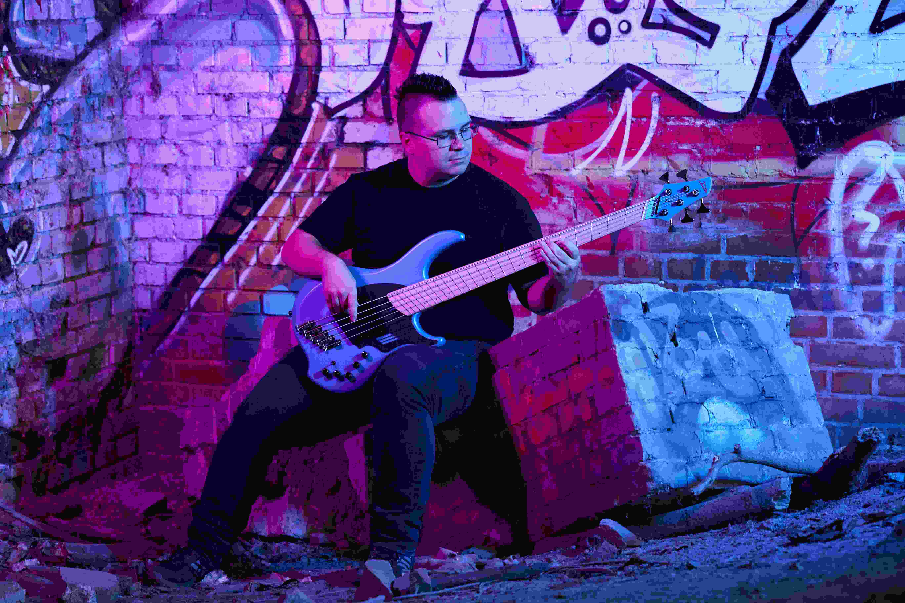

# Hi, I'm Peter

I'm a musician based in _Karlsruhe, Germany_. I live for the _electric bass_ and _synthesizers_. I started writing my own original music and mixing other artists' songs back in 2020.

# My Philosophy

No matter which instrument you play, or if you use your voice, _the song always comes first_. Great solos are great. But a solo is nothing without the proper buildup, support, and release. As a bassist, a guitarist, keys player, or mix engineer, I always prioritize the song over the individuals. When I play live with you, I won't show off -- unless you want me to!

# Let's Collab

I love doing _original works_, _metal covers_, or _video game soundtracks_. I also love playing live! My expertise lies with the electric bass and the synthesizer. But I have also done rhythm guitars and folk drums before.

My focus is on _Metal_, including various subgenres (think Thrash Metal, Melodic Death Metal, Power Metal). _Soundtracks_ are another passion of mine, be it for video games, visual novels, motion pictures, or series. 

<!--img alt="image" class="vertical-portrait" src="assets/img/smile_pic_1_lofi.jpg"/-->

When we work together, I want you and me to be _proud_ of what we create together. A good bass line, just like a good synth soundscape or a good guitar arrangement, makes your songs _shine_ even more brightly, _hit_ even harder, or draw the audience into the _deepest abyss_.

When I _mix your song_, I love to get my hands on nearly all kinds of music. If it's not Schlager or German Ganster Rap, I'm excited! Hell, even if it is... if you love the music you're making and you're _passionate_ about it, I can probably get into that, too!

Listen to my [discography](/discography) and have a look at the song notes to see what comes from my hands and what comes from my programming.

